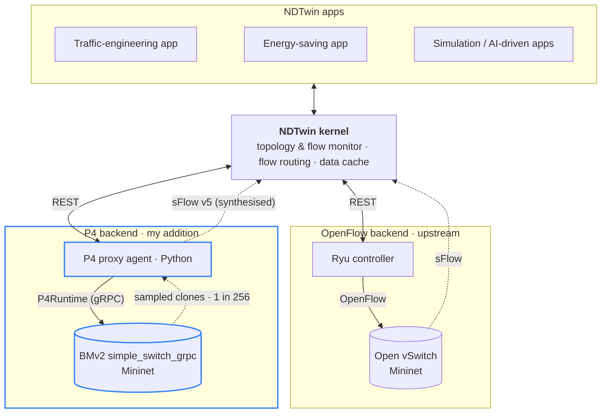

# Hi, I'm Adam Fan

<a href="https://github.com/Adam010341"></a>

- Research Assistant @ Academia Sinica, building an open-source network digital twin.
- Junior @ NCKU, Purdue ECE–NCKU CSIE Dual Degree Program candidate.

<!-- CARD:START -->
```text
     .--.        adam@ndtwin
    |o_o |       -----------
    |:_/ |       Host       NCKU CSIE × Purdue ECE (dual degree candidate)
   //   \ \      Role       Research Assistant @ Academia Sinica NSL
  (|     | )     Focus      NDTwin, P4/BMv2 development line
 /'\_   _/`\     Languages  C · C++ · Python · P4 · Java · Verilog · MATLAB · asm
 \___)=(___/     Research   learned indexes for packet classification,
                            measurement validity in BMv2 benchmarking
                 Contact    adam010341@gmail.com
                 -----------
                 Repos      13 public · 12 stars
                 Commits    723 in the past year
                 Followers  5
```
<!-- CARD:END -->

## Education

- NCKU CSIE, Junior · Purdue ECE–NCKU CSIE Dual Degree Program candidate
- GPA 3.85/4.0
- TOEIC 980/990

## Experience

- Summer intern, Network and System Laboratory, Academia Sinica — Jul 2026 — Sep 2026
- Research Assistant, Network and System Laboratory, Academia Sinica — Sep 2026–
- Undergraduate Researcher, Computer & Internet Architecture Lab, NCKU — Jul 2026–
- Class representative, Purdue ECE–NCKU CSIE Dual Degree Program

## What I'm working on — [NDTwin](https://ndtwin.org)

[](https://github.com/Adam010341/NDTwin-Kernel-P4/actions/workflows/ci.yml)
[](https://github.com/Adam010341/NDTwin-Kernel-P4/commits/main)


- **P4/BMv2 support** — NDTwin ran only on Open vSwitch + Ryu; I'm adding a BMv2 control plane behind the same kernel APIs.
- **Testing & CI** — unit tests, plus GitHub Actions running build, ctest and ASan/UBSan/TSan on every push.
- **Performance** — kernel CPU usage and flow-sampling precision.
- **Fault injection** — chaos harnesses to probe defects and race conditions.
- **Open-source release** — installation manual and VM images.



<picture>
  <source media="(prefers-color-scheme: dark)" srcset="assets/p4-packet-walk-dark.svg">
  
</picture>

## Research

- Learned index structures for dynamic packet classification — NCKU CIAL, advised by Prof. Yen-Kuang Chang
- Measurement validity in BMv2 benchmarking (preprint in prep) — Independent research

### Tech stack

<a href="https://skillicons.dev"></a>

### Repositories

<p>
<a href="https://github.com/Adam010341/NDTwin-Kernel-P4"><picture><source media="(prefers-color-scheme: dark)" srcset="assets/cards/NDTwin-Kernel-P4-dark.svg"></picture></a>
<a href="https://github.com/Adam010341/ndtwin-analysis"><picture><source media="(prefers-color-scheme: dark)" srcset="assets/cards/ndtwin-analysis-dark.svg"></picture></a>
<a href="https://github.com/Adam010341/cache-aware-riscv-optimization"><picture><source media="(prefers-color-scheme: dark)" srcset="assets/cards/cache-aware-riscv-optimization-dark.svg"></picture></a>
<a href="https://github.com/Adam010341/fourier-comms-matlab"><picture><source media="(prefers-color-scheme: dark)" srcset="assets/cards/fourier-comms-matlab-dark.svg"></picture></a>
<a href="https://github.com/Adam010341/PIC18F4520-Assembly-Labs"><picture><source media="(prefers-color-scheme: dark)" srcset="assets/cards/PIC18F4520-Assembly-Labs-dark.svg"></picture></a>
<a href="https://github.com/Adam010341/rvv-mel-spectrogram"><picture><source media="(prefers-color-scheme: dark)" srcset="assets/cards/rvv-mel-spectrogram-dark.svg"></picture></a>
</p>

adam010341@gmail.com

<picture>
  <source media="(prefers-color-scheme: dark)" srcset="https://raw.githubusercontent.com/Adam010341/Adam010341/output/github-snake-dark.svg">
  
</picture>

<sub><b>Latest commits to <a href="https://github.com/Adam010341/NDTwin-Kernel-P4">NDTwin-Kernel-P4</a></b></sub>

<!-- BLOG-POST-LIST:START -->
- <sub>[docs: README -- sFlow carries sampled packets; counters come from /st…](https://github.com/Adam010341/NDTwin-Kernel-P4/commit/8db4f06b10087c457178e13adbe91b248aacb5e8) · 2026-09-24</sub>
- <sub>[docs: README -- NDTwin architecture figure and the P4 pipeline as a M…](https://github.com/Adam010341/NDTwin-Kernel-P4/commit/198bce60e6cd8b1078c3a0fe51e170567c3917e3) · 2026-09-24</sub>
- <sub>[doc: stage-three report to Adam &lpar;2026-09-24&rpar; -- what to rule, what wa…](https://github.com/Adam010341/NDTwin-Kernel-P4/commit/141d1b86c203c8e820caf448d8223c7e3eecebc6) · 2026-09-24</sub>
- <sub>[Merge Adam010341/main &lpar;README badge row, 699b7c85&rpar; into trunk so trun…](https://github.com/Adam010341/NDTwin-Kernel-P4/commit/5f1d4611420dd8e53c6ca01ae243a15cc8b5f052) · 2026-09-24</sub>
- <sub>[P3 FINDINGS: sections 3 and 4 filled by script from the fifth campaig…](https://github.com/Adam010341/NDTwin-Kernel-P4/commit/adb3a0aa456deac65623d437c094eec4e4280dbc) · 2026-09-24</sub>

<!-- BLOG-POST-LIST:END -->

<sub><b>Coding activity</b></sub>

<!--START_SECTION:waka-->
<sub>Weekly coding-time stats from <a href="https://wakatime.com">WakaTime</a> will appear here once the <code>WAKATIME_API_KEY</code> repository secret is added.</sub>
<!--END_SECTION:waka-->
